# Learning Objectives
- Define a linked list
- Illustrate how git logs or histories are created.
- Use git rebase to replay commits on top of another reference
- Identify how rebase is used to pull in upstream changes
- Use an interactive rebase to reword commit messages
- Use an interactive rebase edit a commit
- Use an interactive rebase to squash a commit(s)
- Use an interactive rebase to drop a commit(s)


# Framing

We generally use rebase to merge in upstream changes to our current branch. It's a process on some teams that have become akin to git pull. We often pull in the latest changes from master and then rebase our feature branch against that master branch.

> PSA: we wont be getting into the merits of merge vs rebase, holy wars are fought over this.

In order to learn how to modify our history rebasing interactively, we need to have a clear understanding of what rebasing is and how it works.

A strong foundation in knowledge of commit histories and the relationship of one commit to another commit will help us explore what actually happens in a rebase.

Today we'll try and bridge some of those gaps in our knowledge in order to effectively and purposefully change our git histories.

# [The linked list](https://en.wikipedia.org/wiki/Linked_list)

Straight out of wikipedia:

> A linked list is a linear collection of data elements, whose order is not given by their physical placement in memory. Instead, each element points to the next.

# Commits

A git repo is just a linked list of commits. Every commit besides the initial commit, points to at least 1 commit. To illustrate this lets take a look at a very simple git history.

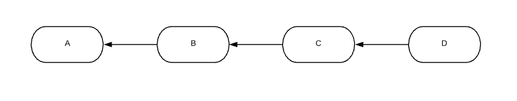

In this diagram, `D` points to `C`, `C` points to `B`, and finally `B` points to `A`. Commits only have pointers to their direct ancestors, it is only through these pointers that we can construct git logs and histories.

Let's take a look at a very common problem we come across in git. That problem is how to bring in upstream changes.

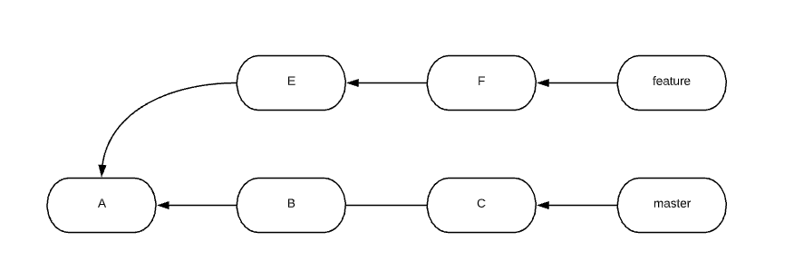

# Merging

One way we can solve this problem is through a merge:

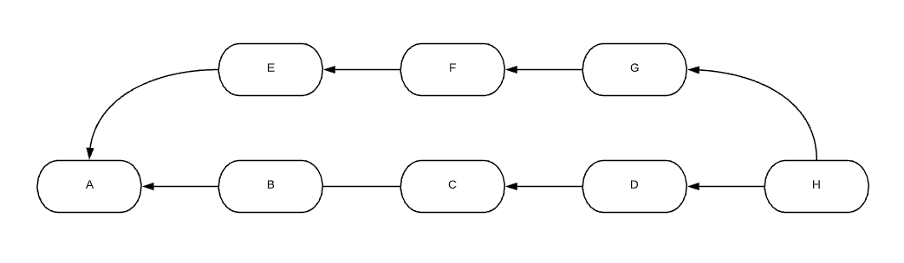

We might notice that the diagram presenting the common problem had branch names of feature and master, we opt for the letters representing commits here. Depending on *where* merged we merge the branch, we could have two different different diagrams using branches.

Here's one of the ways it could go down:

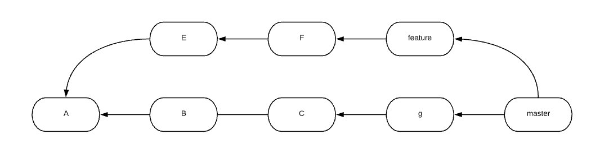

And here's another:

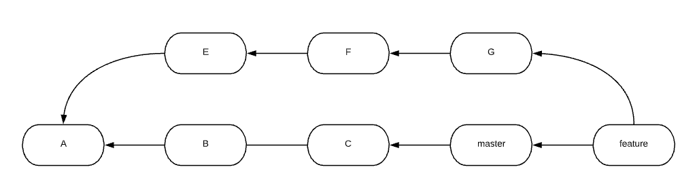

These diagrams are here to illustrate that branches are merely pointers to a commit, a single commit. The reality is that two commits are being merged, not two branches. The above diagrams represent the same thing. They just had different branches pointing to them.

We'll be sticking to labeling commits with letters in this lesson. This will help us conceptualize future diagrams.

# Rebasing

There's one more way to "merge" the code in the following problem:

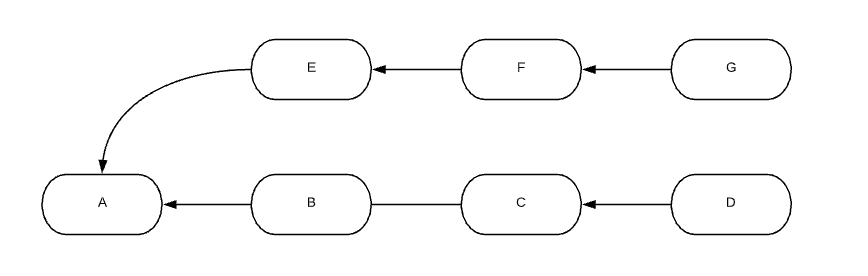

We can rebase 1 or more commits on top of another commit.

In this case, we would rebase commits `E`, `F`, and `G` on top of commit `D`. If these were branch names the git command to this would look something like this:

```
$ git rebase D G

// or
$ git checkout G
$ git rebase D
```

In order to do this git works the histories back from each of the tips until it finds a common ancestor. In this case, commit `A`. It then grabs the diff between the commit we are rebasing(in our case `G`) and the common ancestor(in our case `A`).

It stores that diff into temporary files:

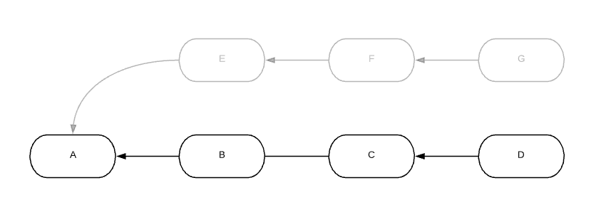

It then moves the HEAD(current branch) to where we want to rebase(in our case `D`).

After it moves to the commit were rebasing against, it will then replay the commits that got stored temporarily one by one. It will look something like this:

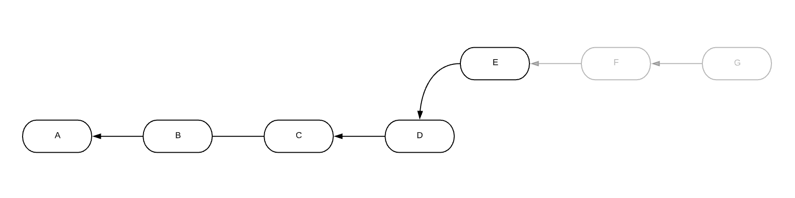
<br>
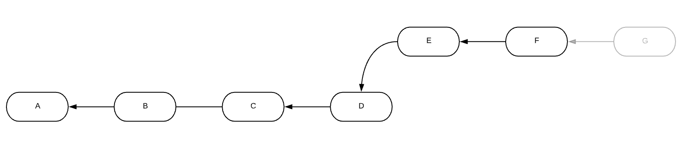
<br>
<br>
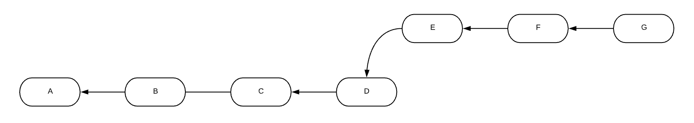

> If at any point during each of the replays of `E`, `F`, and `G` conflict with the commit history of `D` a merge conflict will have to be remedied. Check [here](https://github.com/andrewsunglaekim/advanced_git_workshop#merge-conflicts-5115) on how to resolve merge conflicts during a rebase.

> one more PSA: rebasing **rewrites** history always use with caution.

Once the last commit has replayed the rebase has been completed.

Now that we have laid a foundation for rebasing and how it works. Let's now chat about interactive rebasing.

# Interactive rebasing

So many times in development, we commit things we don't necessarily want to commit. Maybe we misspelled something in our commit message. Maybe we left in a couple of log statements that don't belong. Perhaps we didn't want some of the commits at all.

We often turn to `reset` and say bugger all, let's restart.

Often times, however, we can find our solution in an interactive rebase.

Interactive rebasing works such that we have the ability to interact with the replay of each commit.

When pulling in upstream changes, we generally just do a regular rebase. Since we want the upstream changes as is, we usually don't want to change them through an interactive rebase.

More often then not we interactively rebase a single branch in order to rewrite the history of that branch.

Let's take the finished feature branch above after the sucessful rebase:

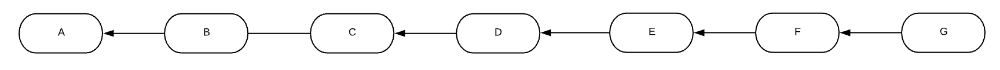

In order to change the history of this commit `G` with an interactive rebase, we could do something like this:

```
$ git checkout G
$ git rebase D -i
```
